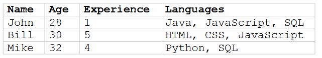

# Home-work-6

## Task 1.

У файлі [task1.js](task1.js) 
1. Створіть новий об'єкт `user`;
2. Додайте властивість `name` із значенням `Cris`;
3. Додайте властивість `surname` зі значенням `Simons`;
4. Змініть значення name на `Brain`;
5. Видаліть властивість `name` з об'єкта.

## Task 2.

У файлі [task2.js](task2.js) 
1. Створіть новий об'єкт `car`;
2. Додайте властивість `model` з будь-яким значенням;
3. Додайте властивість `speed` з будь-яким значенням;
4. Додати метод `run()`, який виводить повідомлення: "model їде зі швидкістю
speed";
5. Додайте метод `stop()`, який виводить повідомлення: "model зупинилася";
Реалізуйте 3 версії завдання, використовуючи наступні синтаксиси створення
об'єктів: **Стандартний**,  **Масивоподібний** та **Спрощений**.

## Task 3.

У файлі [task3.js](task3.js)
1. Створіть новий об'єкт `tv`;
2. Додайте властивість `currentChannel` зі значенням `1`;
3. Додайте метод `nextChannel()`, який збільшує `currentChannel` на одиницю;
4. Додайте метод `previousChannel()`, який зменшує поточний `currentChannel` на
одиницю;
5. Додати метод `setChannel(number)`, який переходить на канал за номером.

## Task 4.

У файлі [task4.js](task4.js) створити об'єкт, який описує MP3 плеєр. Об'єкт має містити мінімум 2 поля і 2 методи, але можна і більше.

## Task 5.

У файлі [task5.js](task5.js) опишіть інформацію, представлену на картинці у вигляді ієрархії масивів та об'єктів



## Task 6.

У файлі [task6.js](task6.js) створіть функцію `isEmpty(obj)`, яка повертає `true`, якщо в об'єкті немає властивостей
та `false` – якщо хоч одна властивість є.

## Task 7.

У файлі [task7.js](task7.js) є об'єкт `salaries` з зарплатами. Напишіть код, який виведе середнє значення всіх зарплат. Код має працювати з різною кількістю зарплат в об'єкті
```js
var salaries = {
  John: 100,
  Bill: 300,
  Mike: 250
};
var salaries = {
  Cris: 150,
  Brain: 600,
  John: 300,
  Steve: 400,
  Bill: 50
};
```


